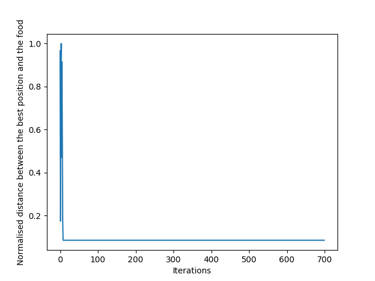

## Assignment answers

---

### Q 1.a

> Explain the inspiration, the main features and the expected function of the algorithm in words.

The novel metaheuristic optimisation algorithm described within this assignment has been inspired by Mitic, Vukovic, Petrovic and Miljkoiv (2015). , whose paper concerned a Fruit Fly Optimisation algorithm.

FOA algorithms model the movement of a swarm of fruit flies towards food. They do so with regard to the interactions between individual fruit flies and the swarm. Individual fruit flies can not see the food. However, they are able to smell the food.

There are two main phases within FOA algorithms. In the first of them, the smell phase, the concentration of the smell of food associated with each fruit fly is calculated. The fruit flies closest to the location of the food should be associated with a greater smell concentrations. In the second phase, the vision phase, the swarm moves towards the fruit fly associated with the greatest smell concentration. After repeated iterations of the these phases the swarm should converge on the food.

The main additional feature proposed by Mitic, Vukovic, Petrovic and Miljkoiv (2015) is the incorporation of randomness within the smell phase. They suggested that this will improve the speed (measured by number of iterations) with which the swarm converges upon the food and, thereby, optimises the required function. This appears to be a convincing argument. However, it might be the case that exploration is being favoured over exploitation. That is, there may be values for which the algorithm proposed by Mitic, Vukovic, Petrovic and Miljkoiv (2015) is not faster than a standard FOA.

---

### Q 1.b

> If the paper contains several algorithms, then choose only one and justify your choice.

The chosen algorithm used a Chebyshev chaotic map. Chaotic maps are functions that exhibit chaotic behaviour. more specifically, a Chebyshev chaotic map takes the cosine of the inverse cosine of a value. This produces results between -1 and 1. The Chebyshev chaotic map was found to be the most successful map used by Mitic, Vukovic, Petrovic and Miljkoiv (2015), which was why it was chosen to be reproduced within this assignment.

In addition, the algorithm used by Mitic, Vukovic, Petrovic and Miljkoiv (2015) optimised standard functions. One of the most successful was Sum of Squares, which has been used within this assignment.

---


### Q 2.a

> Present and explain the main formulas that define the algorithm.

The main formulas used within the FOA algorithm by Mitic, Vukovic, Petrovic and Miljkoiv (2015) are as follows.

The algorithm starts by randomly allocating the food and the fruit flies to positions within the search space. The random allocation of the food was not defined, explicitly. However, the random allocation of the fruit fly positions was defined, and it calculates a pseudo random value based upon the lower and upper bounds of the search space.

```JavaScript
// PSEUDO CODE

fruitFly = lowerBound + (upperBound - lowerBound  * rand());
```

Within the smell phase, fruit flies are pseudo randomly re-positioned with regard to their previous best position and `alpha`, where `alpha` represents the output of the Chebyshev chaotic map. The re-positioning is defined using the following formula:

```JavaScript
// PSEUDO CODE

fruitFly (nextPosition) = fruitFly (currentPosition) + alpha(currentPosition - bestPosition);
```

Within the vision phase, smell concentration per fruit fly is defined as the inverse of the distance between the fruit fly and the food. Smell concentration increases as the distance between a given fruit fly and the food decreases. Conversely, smell concentration decreases as the distance between a given fruit fly and the food increases.


```JavaScript
// PSEUDO CODE

distance = SQAURE_ROOT((fruitFly)SQUARED + (food)SQUARED);
smellConcentration = 1 / distance;
```

Per iteration, the swarm moves toward the fruit fly with the maximum smell concentration. This process is defined by the following formula:

```JavaScript
// PSEUDO CODE

xBest = min (smellConcentration per fruit fly);
```

---

### Q 2.b

The parameters used by Mitic, Vukovic, Petrovic and Miljkoiv (2015) for the Chebyshev chaotic map / Sum Squares algorithm are as follows:

- Number of fruit flies = 30
- Number of trials = 50
- Iterations per trial = 700
- Search space lower bound = -10
- Search space upper bound = 10

---

### Q. 3

> Discuss the results given in the paper

---

### Q 4.a

> Explain your approach towards the reproduction of the algorithm of the paper:

The approach taken to reproduce the algorithm described by Mitic, Vukovic, Petrovic and Miljkoiv (2015) was motivated by portability. Consequently, the code associated with this assignment has been written in JavaScript. This means that it can be run within any web browser. Thus, potential compatibility problems that might have arisen had the algorithm been written in a specific server side language have been avoided.

In order to load the algorithm, open the following HTML page `dist/index.html` within a browser. The resulting page will display a form with fields representing the algorithm's parameters. The fields have default values for the Chebyshev chaotic map / Sum Squares combination. Modify the parameters as required. Then click the `run` button and the results should be printed at the bottom of the page.

The JavaScript code contains a separate module for each of the algorithm's key components.
- The `src/food.js` class defines the coordinates of the food.
- The `src/fruitFly.js` class defines the coordinates and all of the processes that can be applied to a fruit fly.
  - This class also retains the coordinates of the best position per fruit fly.
- The `src/fruitFlies.js` aggregates the fruit flies and handles communication between them and the swarm.
- The `src/swarm.js` class represents the swarm.
- `src/alpha.js` contains functions handling the Chebyshev chaotic map.
- Finally, `src/foa.js` contains functions representing the algorithm's phases, such as `smell` and `vision`.

In addition, `src/print.js` contains a function that prints the algorithm's results onto the loaded web page in `.csv` format, enabling the data to be easily copied into statistical / charting software.

Further information about how to load the algorithm (along with a description of the build and testing process for the modules described above) can be found within the `README.md` file at the root of the code-base.

---

### Q 4.b

> What simplifications or modifications had to be made?

One simplification that was made concerned the calculation of the fruit fly with the best position. This calculation is used within the algorithm's vision phase. The pseudo code provided by Mitic, Vukovic, Petrovic and Miljkoiv (2015) indicates that the best positioned fruit fly (at least for standard, rather than chaotic FOA) would have the lowest smell concentration (with regard to the function being optimised). Smell concentration is the inverse of the distance between a fruit fly and the food. A fruit fly with the minimum smell concentration would be the one furthest from the food. Consequently, the best position calculation was modified to find the fruit fly with the maximum smell concentration (with regard to the function being optimised). The method that performs this calculation is called `findBestPosition` and it can be found within the `src/fruitFlies.js` class between lines `108` and `124`.   

Another modification that was made concerned the movement of the swarm. Per iteration, the swarm moves towards the fruit fly with the best position (as calculated by the function being optimised). It was assumed that the difference between the swarm's `n` and `n+1` positions should be applied to all of the fruit flies. The method that performs this calculation is called `transpose` and it can be found within the `src/fruitFly.js` class between lines `233` and `241`.   

A further modification concerned the calculation used to determine the initial position of the food. This was not defined by Mitic, Vukovic, Petrovic and Miljkoiv (2015). However, it was assumed that the calculation would be identical to one used for the generation of the initial fruit fly positions. The method that performs this calculation is called `generateFoodCoordinates` and it can be found within the `src/food.js` class between lines `44` and `55`.

Lastly, the `alpha` function, which contains the Chebyshev chaotic map, only accepts values between `-1` and `1`. However, the values being passed to `alpha` are the difference between the fruit fly's current and best positions. In the majority of cases, such positional values were greater than the `-1` to '1' boundary. Consequently, the fruit fly's current and best positions have been normalised (by dividing both of them by the upper bound of the search space). This is performed by the `smell` method within `src/fruitFly.js` between lines `155` and `231`.

---

### Q 4.d

> What benchmark functions are you going to use and why?

The benchmark function that will be used to access the success of the novel algorithm is a simplified version of the one used by Mitic, Vukovic, Petrovic and Miljkoiv (2015).

The function being optimised, in this case the Sum of Squares, is used to calculate the `n + 1` position for the swarm (with regard to the positions of the fruit flies orbiting the swarm). The result of that calculation is described as the 'best position' for swarm (per iteration). The distance between the swarm (or the best position) and the food (at the end of a trial) is the dependent variable.

*For further information, please see the `findBestPosition` method within the `fruitFlies.js` class.*

The adopted benchmark function thus examines whether or not the dependent variable (at the end of a given trial) is equal to or less than a particular criterion.

Mitic, Vukovic, Petrovic and Miljkoiv (2015) adopted a 'relative' criterion, evaluating the dependent variable (per trial) with regard to the distance produced by the most successful trial (out of 50 trials).

Given that the results from the novel algorithm were not as successful as expected (as described within Question 6) the use of such a 'relative' criterion was not considered to be appropriate. That is, if the 'relative' criteria has been used all of the results produced by the novel algorithm would have been classed as successful, when the majority were not.

To that end, the adopted criterion examined whether or not the distance between the swarm and the food (at the end of each trial) when divided by the width of the search space (upper boundary - lower boundary) is equal to or less than `0.4`. Please see the pseudo code below for further information about the adopted criterion.

```JavaScript
// PSEUDO CODE: BENCHMARK FUNCTION

if ((distance / search_space_width) < 0.4) {
  return 'success';
} else {
  return 'fail';
}
```

`0.4` represents `2%` of the width of the search space (given that the lower bound is `-10` and the upper bound is `10`) and was considered to be reasonably stringent criterion.   


---

### Q5.

> Choose one of the standard metaheuristic optimisation algorithms (such as SA,
ES, GA, PSO, or ACO) that is similar (but obviously not identical) to your algorithm.

Particle Swarm Optimisation is a metaheuristic optomisation algorithm that has similarities to the Fruit Fly Optimisation algorithm associated with this assignment. Both are p-series or population based algorithms, meaning that the result is an emergent property of a movement within and forms of communication between populations of particles or fruit flies. On the other hand, they differ in a number of important aspects.

Differences between PSO and FOA

---

### Q6.

> Present the results of your implementation of the algorithm, compare the results with corresponding results from the standard algorithm.

The novel version of the chaotic fruit fly optimisation algorithm was run for `50` trials. Each trial consisted of `700` iterations and `30` fruit flies, with a search space lower bound of `-10` and an upper bound of `10`.

As described in Question 4.d, the function being optimised, in this case the Sum of Squares, is used to calculate the `n + 1` position for the swarm (with regard to the positions of the fruit flies orbiting the swarm). The distance between the swarm and the food (at the end of a trial) is the dependent variable. When the dependent variable was evaluated using the benchmark function only `13` (or 26%) out of the `50` trials were successful.

The mean normalised distance between the swarm and the food at the end of each trial was `0.789` (3sf) with a standard deviation of `0.453` (3sf). The minimum was `0.005` (3sf) and the maximum was `1.295` (3sf), as can be seen within **Figure 1** below.

#### Figure 1. Normalised distance between the best position and the food per trial.


---

The data underlying **Figure 1** can be found within the codebase at `data/final_best_position_distance_per_trial.csv`, and the Python script used to produce the figure can be found at `scripts/final_best_position_distance_per_trial.py`. Lastly, a copy of the figure, itself, can be found within `charts/final_best_position_distance_per_trial.png`.

---

The results can be further examined with regard to the most successful trial, number 37 out of 50. Within this trial, the normalised distance between the swarm and the food stagnated at a minimum value after approximately `10` iterations, as can be seen within **Figure 2** below.

The mean normalised distance between the swarm and the food per iteration (for trial number 37) was `0.092` (3sf) with a standard deviation of `0.469` (3sf). The minimum was `0.085` (3sf) and the maximum was `1.0`.

#### Figure 2. Normalised distance between the best position and the food per iteration for trial number 37.



---

The data underlying **Figure 2** can be found within the codebase at `data/best_trial_distance_per_iteration.csv`, and the Python script used to produce the figure can be found at `scripts/best_trial_distance_per_iteration.py`. Lastly, a copy of the figure can be found within `charts/best_trial_distance_per_iteration.png`.

---

In contrast, the least successful trial, number 22 out of 50, stagnated at a maximum after approximately 10 iterations, as can be seen within **Figure 3** below.

The mean normalised distance between the swarm and the food per iteration (for trial number 22) was `0.994` (3sf) with a standard deviation of `0.059` (3sf). The minimum was `0.109` (3sf) and the maximum was `1.0`.

#### Figure 3. Normalised distance between the best position and the food per iteration for trial number 22.


---

The data underlying **Figure 3** can be found within the codebase at `data/worst_trial_distance_per_iteration.csv`, and the Python script used to produce the figure can be found at `scripts/worst_trial_distance_per_iteration.py`. Lastly, a copy of the figure can be found within `charts/worst_trial_distance_per_iteration.png`.

---

The novel algorithm was run for a second time using the same parameters as above. That is, it was re-run for `50` trials. Each of the trials consisted of `700` iterations and `30` fruit flies, with a search space lower bound of `-10` and an upper bound of `10`. With regard to the distance between the swarm and the food, the resulting dataset contained all distances per iteration per trial. The mean standard deviation of the distances per iteration (across all trials) was `1.533` (3sf).

When the first ten iterations were removed from the dataset describe above, the mean standard deviation of the distances across the remaining iterations (for all trials) decreased to `0.639` (3sf). The first ten iterations thus appear to have accounted for a majority of the standard deviation in the distance between the swarm and the food.

This finding suggests that the majority of the trials were stagnating after approximately 10 iterations, and this suggestion will be discussed further in Question 7, below.

---

The results from the second set of trials can be found within `data/second_set_of_trials_all_distances_per_iterations.csv`, and the Python script used to produce the mean standard deviation values above can be found at `scripts/second_set_of_trials_all_distances_per_iterations.py`.


---

### Q7a

> Discuss here question such as: Did your algorithms perform as expected? If not, why not? If yes, why did the algorithms perform as it did?

Unfortunately, the novel algorithm did not perform as expected with only 26% of the trials proving to be successful.

The findings from the second run of the novel algorithm suggested that the first ten iterations of the algorithm (across all trials) appeared to account for a majority of the standard deviations in the distance between the swarm and the food. Consequently, the majority of the trials appear to have found local rather than global maxima, because there was little or no change after approximately 10 iterations.

It is suggested that the problem described above may have been caused by erroneous normalisation of the values passed to alpha (from within the `fruitFly.js` class). Per iteration, each fruit fly should reposition itself within the search space, and it should do so regard to alpha, along with the fruit fly's current and previously best positions. Alpha values are derived from a Chebyshev chaotic map, which returns a maximum value of `6.1232e-17` when it's input is `0`. However, the chaotic map only accepts inputs between `-1` and `1`.

To ensure that the chaotic map would always receive values in the correct range, the inputs were normalised (see lines `169` to `172` within the `fruitFly.js` class). As a consequence of such normalisation, the `src/fruitFly.js` class will have called the chaotic map with inputs close to zero, which will have produced large values for alpha. In turn, such large alpha values may have forced the fruit flies to move towards the boundaries of the search space, causing stagnation.

The suggestion has been supported by a re-inspection of the data for the best and worst trials (`data/best_trial_distance_per_iteration.csv` and `data/worst_trial_distance_per_iteration.csv`, respectively), which suggests that once fruit flies find themselves at the edge of the search space they are unlikely to be pushed back towards the centre.

In summary, the relatively poor performance of the novel algorithm may have been caused by erroneous normalisation within the `src/fruitFly.js` class.

---

### Q7.b

> What could have been improved if there was one more week (or one more year) to work on the problem?

One of the key improvements that could have been made would have been to replace the current Cartesian positioning with matrix and vector manipulations, which might have simplified the code. Unfortunately, matrix and vector manipulation functions are not available by within the core JavaScript language, but a library such [math.js](http://mathjs.org/docs/datatypes/matrices.html) could be introduced.  

Another improvement that could have been made relates to the interpretation of the results produced from the novel algorithm. It would be advantageous to be able to directly visualise them within the web page (perhaps using a graphics library such as D3).


With regard to the speed of running the JavaScript based algorithm within a web browser, the code could be cross-compiled into [Low Level JavaScript](https://github.com/mbebenita/LLJS) or [Web Assembly](https://webassembly.org/), both of which aim to provide near C speeds of code interpretation.

---


### Q7.c

> How general are the results?  

The results are portable having been written in JavaScript and designed to run in any JavaScript enabled web browser. Less positively, the novel algorithm's code uses Cartesian positioning with two fixed dimensions. Attempting to use the novel algorithm to optimise a function with more than two dimension would require a significant re-write. Thus, while the novel algorithm is portable, it may not be very general, having been written to optimise functions with only two dimensions.

---


### Q7.d

> How (or how not) to interpret the results

Although the novel algorithm did not perform as expected, overall the results are positive. A portable JavaScript based implementation of a FOA has been produced, and it may not require much further work to fully reproduce the findings of Mitic, Vukovic, Petrovic and Miljkoiv (2015).

---

Please note that due to problematic family circumstances - my father has recently been diagnosed with Alzheimer's disease - I started this project only a couple of days prior to the deadline for submission. Consequently, I was unable to work on it with my designated partner. To that end, the work within this report and the associated JavaScript code-base are completely my own.
